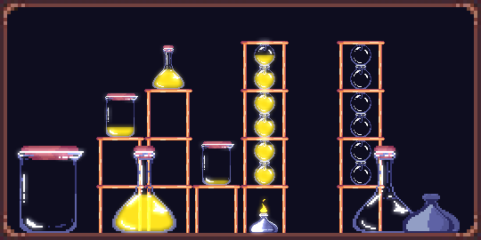

# Marimba
A basic WebGL2 engine with Multiple Render Targets, Post Processing, Batch Rendering (explored with the Cymbale project) and Scene Management.

Marimba is not a generic engine but a specific platform to develop an [Alchemy Game](https://wonshtrum.itch.io/conflatorium).

