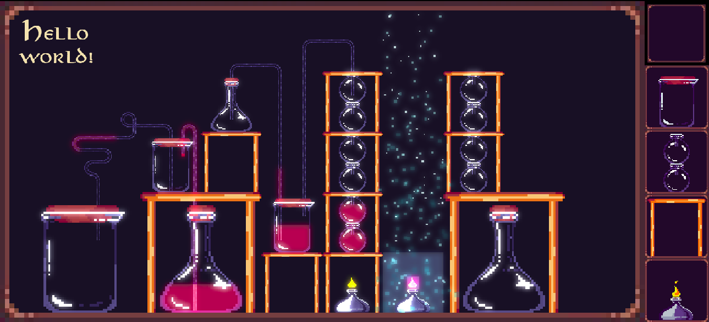

# Marimba
A basic WebGL2 renderer with Multiple Render Targets, Post Processing and Batch Rendering (explored with the Cymbale project).

Marimba is not a generic engine but a specific platform to develop an Alchemy Game.

